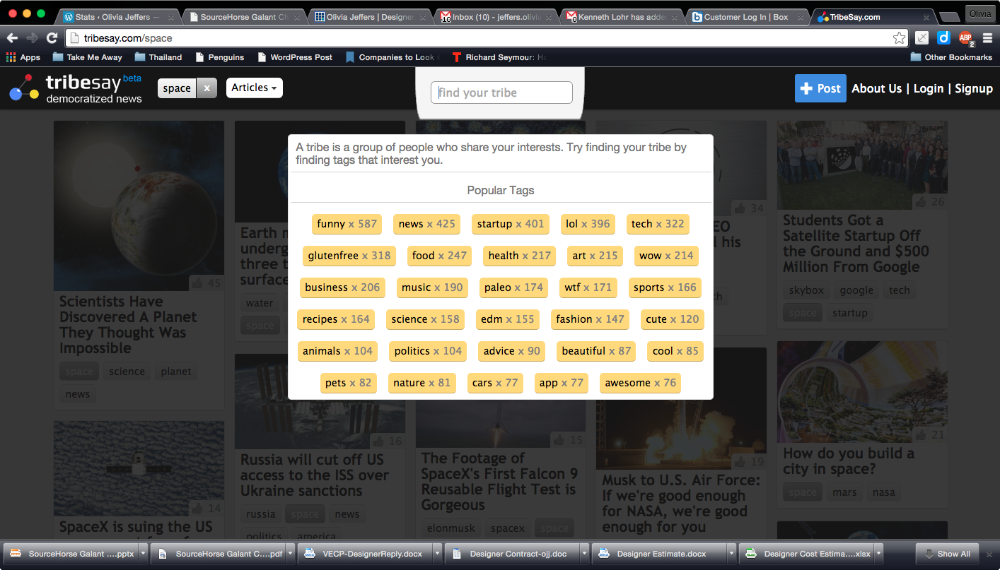

Originally stored on @MartianMartin's [myStream repo](https://github.com/martianmartin/myStream):

myStream
========

9.11 11.36am

The myStream repo is a stand-in php project used in order to configure work flow processes by me. Olivia is a buttface.